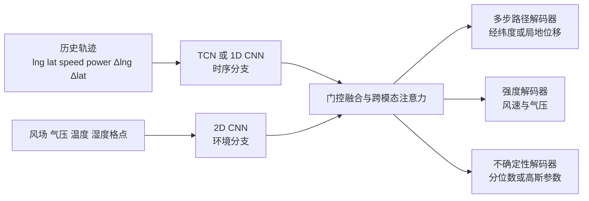

# 基于 CNN 与 Cesium 的热带气旋可视化与预测系统

本项目面向热带气旋历史轨迹分析、未来路径与强度预测，以及预测结果的三维地理可视化。项目材料包括课程报告 `baogao.docx`、台风最佳路径数据 `data/` 和 Vue/Cesium 前端工程 `CNN-Cesium/`。

当前 README 按代码、数据和实测结果编写。报告中的气象融合、实时接口、概率锥体和实验结论，只有在补齐数据、代码、校准和运行证据后，才能作为已经完成的功能对外表述。

## 当前核查结论

逐阶段验收清单见 [IMPLEMENTATION_PLAN.md](IMPLEMENTATION_PLAN.md)。

### 已有内容

| 内容 | 当前情况 |
| --- | --- |
| 台风年度索引 | `data/year/` 有 1945-2024 年共 80 个 JSON 文件 |
| 台风轨迹文件 | `data/typhoon/` 有 1,905 个文件，其中 1,903 个文件包含有效轨迹对象，2 个文件为空 |
| 轨迹观测点 | 共约 72,389 个点；单个台风轨迹点数中位数为 33 |
| 数据字段 | 经纬度、时间、风速、风力、气压、风圈半径、移动方向和移动速度等 |
| 前端技术栈 | Vue 3、TypeScript、Vite、Cesium、Pinia、Element Plus、ECharts、`cesium-wind-layer` |
| 构建产物 | `CNN-Cesium/dist/` 已有 Cesium 静态资源、天空盒、地球贴图和风场资源 |

### 当前阻塞项

| 阻塞项 | 影响 | 必须补齐的验收物 |
| --- | --- | --- |
| `CNN-Cesium/src/` 已恢复 | 前端可以从源码重新构建，仍需补齐更完整的功能模块 | 路由、图表、风场和预测视图 |
| `CNN-Cesium/public/` 不存在 | 天空盒、风场等静态资源没有源码入口 | `public/skyboxs/`、`public/wind/` 和图片资源 |
| `CNN-Cesium/model.pth` 仍为 0 字节 | 这是原有空文件，不被后端使用 | 有效权重位于 `artifacts/checkpoints/track_cnn_baseline.pth`，后端已加载 |
| CNN 已完成固定测试集评估 | `/api/predict` 已运行；路径误差仍需按时效改进 | 保存逐时效指标，不把部分时效的提升宣传为全时效提升 |
| `node_modules` 已恢复 | 前端检查和构建可运行 | 固定 Node/pnpm 版本并在新环境重装 |
| Vite 已支持本地后端代理 | 后端未启动时前端接口会失败 | 启动 `backend.app.main:app`，或将 `VITE_HTTP_PROXY=N` 切回 Vite 本地数据插件 |

## 报告与仓库的差异

这些差异需要在代码、实验记录和报告中统一，否则答辩时很容易被追问。

1. 报告写的是 1949-2025 年、1,234 个案例；当前数据实际覆盖 1945-2024 年，年度索引共 1,905 条记录，2025 年数据不存在。
2. 报告把输入描述为每 6 小时一个观测点，但实际数据同时出现 1 小时、3 小时和 6 小时等间隔。训练前必须按时间重采样，或明确把时间间隔作为输入特征。
3. 报告声称融合风场、气压等再分析格点数据；当前 `data/` 主要是台风轨迹 JSON，没有可供 CNN 使用的气象格点数据文件。补充 ERA5、CMA 或其他有明确来源和版本的数据后，才能保留“多源气象融合”的表述。
4. 报告描述了 Python 模型服务、`GET /api/typhoons`、`POST /api/predict` 和概率锥体；历史 API、CNN 推理和有效 checkpoint 已接通。概率锥体仍未实现，预测区间字段为 `null`，等待独立校准和覆盖率验收。
5. 报告使用 CesiumJS 1.104、Vue 3.3 等环境描述；当前 `package.json` 使用 Cesium 1.124、Vue 3.5、Vite 6。实验环境、报告和锁文件应统一到同一版本。
6. 报告表格中经纬度误差和 TDE 使用百分比，风速单位写成 `km/s`，这些单位不适合直接解释路径误差。建议统一为公里、度和 `m/s`，并给出计算公式、预测时效和测试集范围。

## 推荐的最终架构

数据量约 52 MB，建议由后端按台风编号读取，不要把全部轨迹打进前端首屏包。建议整理为如下结构：

```text
D:/project/CNN-Cesium/
├─ data/
│  ├─ year/                  # 年度台风索引
│  ├─ typhoon/               # 原始轨迹 JSON
│  ├─ processed/             # 清洗、重采样、归一化后的数据
│  └─ manifest.json          # 数据版本、数量、缺失率、划分信息
├─ ml/
│  ├─ models/                # 网络结构
│  ├─ datasets/              # Dataset、切窗、归一化
│  ├─ train.py
│  ├─ evaluate.py
│  ├─ infer.py
│  └─ configs/
│     ├─ baseline.yaml
│     └─ st_fusion.yaml
├─ backend/
│  ├─ app/main.py            # FastAPI 入口
│  ├─ app/schemas.py         # 请求和响应类型
│  ├─ app/services/data.py   # 台风数据读取、缓存和校验
│  ├─ app/services/model.py  # 模型单例加载和推理
│  └─ requirements.txt
├─ artifacts/
│  ├─ checkpoints/best.pth
│  ├─ metrics/test.json
│  ├─ figures/
│  └─ runs/
├─ CNN-Cesium/
│  ├─ src/
│  │  ├─ api/
│  │  ├─ components/
│  │  ├─ stores/
│  │  ├─ types/
│  │  ├─ views/
│  │  └─ cesium/
│  ├─ public/
│  │  ├─ skyboxs/
│  │  └─ wind/
│  └─ package.json
├─ baogao.docx
└─ README.md
```

前后端之间统一使用 JSON/GeoJSON。后端读取原始数据时兼容 `begin_time` 与 `beginTime`、`is_current` 与 `isCurrent` 两套字段，并在返回前统一为一种格式。

## 算法改进方案

报告中的一维 CNN 多任务模型可以保留为基线。建议增加一个可验证的时空融合模型，暂命名为 `ST-Fusion-UQ`，名称只有在完成实验后再写进最终报告。



建议按以下顺序实现，保证每个改动都能做消融实验：

1. **局地坐标和残差预测**：把经纬度转换为台风中心附近的局地东向、北向位移，预测下一步位移残差，再转换回经纬度。这样可以减少经度在高纬度处的尺度差异，并避免模型直接学习全球绝对坐标。
2. **双分支多源融合**：历史轨迹使用轻量 TCN/1D CNN；风场、海平面气压和温湿度使用 2D CNN；用门控融合或交叉注意力让模型根据当前台风阶段选择轨迹信息和环境信息的权重。
3. **多步直接解码**：当前基线一次输出 6、12、18、24、30、36 小时结果，减少滚动预测的误差累积，并为每个预测时效单独统计指标；更长时效须扩充标签后另行训练和验收。
4. **不确定性预测**：在路径和强度头增加分位数回归或异方差高斯头，输出预测区间。Cesium 中用置信带或概率锥体表示区间，图表同时显示覆盖率和区间宽度。
5. **地理和运动约束损失**：路径使用 Haversine 距离损失，强度使用 Huber/MAE；增加位移平滑和速度一致性损失，形成类似下面的联合目标：

   ```text
   L = λ1 * L_geo + λ2 * L_intensity + λ3 * L_smooth + λ4 * L_uncertainty
   ```

6. **小模型优先**：当前有效轨迹约 1,903 条，不能直接堆叠大型 Transformer。先完成轻量双分支模型和固定预算实验，再比较 Transformer 或 ConvLSTM 是否真的提升。

算法创新的答辩表述必须符合下面的证据链：

> 针对长时效预测误差累积和气象环境信息利用不足的问题，在一维 CNN 基线中加入轨迹与气象格点双分支、门控融合、地理距离损失和不确定性头；在相同数据划分、训练预算和测试集上，与基线比较 TDE、风速 MAE、区间覆盖率和推理耗时，结果见消融表和原始日志。

在没有消融结果之前，不要把“首次使用”“显著提升”“实时预测”写成结论。

## 数据处理要求

当前数据审计的统计结果如下；可复跑命令已生成 `data/processed/manifest.json`：

| 项目 | 已审计结果 | 处理建议 |
| --- | ---: | --- |
| 轨迹文件 | 1,905 | 删除或标记空文件 `196118.json`、`197319.json` |
| 有效轨迹对象 | 1,903 | 以台风编号去重并记录缺失记录 |
| 观测点 | 72,389 | 保存原始点数和清洗后点数 |
| `pressure` 缺失 | 2.88% | 短缺口可插值，同时保留缺失掩码 |
| `radius7` 缺失 | 64.98% | 不要直接用 0 填充；可作为可选任务或掩码监督 |
| `radius10` 缺失 | 71.13% | 同上 |
| `move_dir` 缺失 | 68.24% | 由位移重新计算，并记录计算方法 |
| `move_speed` 缺失 | 67.58% | 由相邻点和时间差计算 |
| 时间间隔 | 同时存在 1、3、6 小时等间隔 | 统一重采样到 6 小时，或显式加入 `delta_hours` |

可以用以下命令重新生成当前原始数据的审计清单：

```powershell
.\.venv\Scripts\python.exe ml\data_audit.py
```

审计清单记录源数据 SHA256 指纹、字段缺失率、观测间隔、索引一致性和按台风编号计算的时间/随机拆分数量。运行以下命令可执行 6 小时重采样和窗口构建：

```powershell
.\.venv\Scripts\python.exe -m ml.prepare_dataset
```

该命令不会修改 `data/year/` 或 `data/typhoon/`；它生成 `data/processed/train.jsonl`、`validation.jsonl`、`test.jsonl` 和完整 `manifest.json`。当前共得到 33,761 个训练窗口、926 个验证窗口和 1,143 个测试窗口。窗口按台风年份划分，输入为 `[4,6]`，输出为未来 6 个 6 小时步长的经纬度和风速。

预处理脚本已按以下规则处理数据：

- 统一字段命名、时间时区和经度范围，明确使用 `0-360` 还是 `-180-180`；
- 删除空轨迹，检查时间倒序、重复时间、非法坐标和重复台风编号；
- 只对短缺口插值，绝不把高缺失率的风圈半径伪造为真实观测；
- 以台风为单位划分训练集、验证集和测试集，禁止把同一台风的相邻窗口拆到不同集合；
- 除随机划分外增加时间外推测试，例如训练 1945-2016 年、验证 2017-2019 年、测试 2020-2024 年；
- 固定输入窗口、预测窗口和训练集归一化参数，生成含数据指纹、版本和拆分信息的 `manifest.json`；随机拆分种子另记录在审计清单中。

### CNN 训练与实测结果

数据预处理完成后，使用 Python 3.8+、PyTorch 2.3.1 和 NumPy 1.24.4 运行：

```powershell
python -m ml.train --device auto
```

训练会保存逐轮日志、验证集最优 checkpoint、SHA256 和固定测试集逐时效结果。当前训练在 CUDA 上以第 57 轮为最佳；测试集是 2020-2024 年的 1,143 个窗口，模型版本 `track-cnn-1d-v1`。结果文件为 `artifacts/runs/20260923T132203Z/test_metrics.json`，日志在同目录 `train.log`，权重为 `artifacts/checkpoints/track_cnn_baseline.pth`。

| 预报时效 | CNN 路径 MAE (km) | 匀速外推路径 MAE (km) | CNN 风速 MAE (m/s) | Persistence 风速 MAE (m/s) |
| ---: | ---: | ---: | ---: | ---: |
| 6 h | 146.40 | 46.84 | 2.79 | 2.21 |
| 12 h | 135.26 | 91.49 | 3.86 | 4.29 |
| 18 h | 150.03 | 142.00 | 4.93 | 6.11 |
| 24 h | 188.28 | 199.89 | 5.85 | 7.68 |
| 30 h | 240.66 | 265.43 | 6.54 | 9.12 |
| 36 h | 302.50 | 339.74 | 7.21 | 10.47 |

CNN 路径在 24-36 小时优于匀速外推，在 6-18 小时较差；风速预测在 6 小时较差、12-36 小时较好。不能将其表述为所有时效都提升。测试窗口在同一台风内存在时间重叠，样本数不等于独立台风数。

当前项目以项目根目录中的 `python -m ...` 方式导入 `ml` 包。重训会生成新的 run 产物；应保留原始日志并按测试指标验收，不把 smoke run 当正式结果。

## 后端接口约定

为兼容当前 `dist` 中已有请求，建议先支持旧接口，再逐步迁移到语义更清晰的 REST 接口。

| 方法 | 路径 | 作用 |
| --- | --- | --- |
| GET | `/health` | 返回服务、数据和模型状态 |
| GET | `/api/years.json` | 返回年度台风索引，兼容当前前端 |
| GET | `/api/{id}.json` | 返回单个台风轨迹，兼容当前前端 |
| GET | `/api/typhoons` | 按年份、名称和强度筛选台风 |
| GET | `/api/typhoons/{id}/points` | 返回统一字段格式的轨迹点 |
| POST | `/api/predict` | 接收历史窗口，返回多时效路径、强度和不确定性 |
| GET | `/api/wind/{time}` | 返回指定时刻的风场数据或缓存地址 |

当前预测接口要求五个连续的 6 小时观测。首个点仅用于计算下一个点的位移，后四个点形成训练时的 `[4,6]` 输入；后四个点的 `speed` 和 `power` 必填。无时区的输入时间按数据源约定解释为 UTC。可请求全部或部分支持时效：

```json
{
  "typhoon_id": "202426",
  "history": [
    {"time": "2024-09-01T00:00:00", "lng": 150.2, "lat": 12.0},
    {"time": "2024-09-01T06:00:00", "lng": 149.4, "lat": 12.3, "speed": 18, "power": 8},
    {"time": "2024-09-01T12:00:00", "lng": 148.6, "lat": 12.7, "speed": 20, "power": 9},
    {"time": "2024-09-01T18:00:00", "lng": 147.8, "lat": 13.1, "speed": 22, "power": 9},
    {"time": "2024-09-02T00:00:00", "lng": 147.0, "lat": 13.6, "speed": 24, "power": 10}
  ],
  "horizons_hours": [6, 12, 18, 24, 30, 36]
}
```

```json
{
  "model_version": "track-cnn-1d-v1",
  "generated_at": "2026-09-23T00:00:00Z",
  "predictions": [
    {"lead_hours": 6, "lng": 146.1, "lat": 14.0, "speed_ms": 24.6, "p05": null, "p95": null}
  ]
}
```

示例中的数值只展示字段格式，不是模型输出。当前没有独立校准的不确定性估计，因此 `p05`、`p95` 保持 `null`，页面不得绘制概率锥体。

模型应在服务启动时加载一次，接口返回 `model_version`、数据时间、输入窗口和单位。发生模型未加载、数据缺失或输入时间不连续时，接口返回明确的 4xx/5xx 错误和可读消息。

## 页面完善方案

继续使用 Vue 3、TypeScript、Pinia、ECharts 和 Cesium，重点完善信息层级和可操作性。

### 页面布局

- Cesium 三维地球作为主视口，保留完整的海陆和台风空间关系。
- 左侧为“台风档案”面板：年份、名称、编号、活动时间、峰值风速、登陆信息和搜索筛选。
- 右侧为“预报诊断”面板：当前点参数、风速/气压曲线、路径误差、预测区间和模型版本。
- 底部为时间轴：播放、暂停、单步、速度、历史/预测分界线和预测时效切换。
- 顶部仅放置全局操作：图层、视角、导出、帮助和数据状态；避免把大量说明文字压在三维场景上。

### 视觉和交互

- 使用深海蓝作为场景底色，搭配青绿、琥珀、珊瑚红表达风速等级和风险等级，保持颜色语义一致，并提供色盲友好模式。
- 采用 8px 以内圆角、细边框和适度阴影，面板保持紧凑，避免卡片套卡片。
- 工具栏按钮使用图标和悬浮提示；播放、定位、图层、导出、全屏等操作不要用长文本按钮占用地图空间。
- 所有颜色图例标注单位和数据来源，历史轨迹、预测轨迹、置信带、七级风圈和十级风圈使用固定图例。
- 处理加载、空数据、接口失败、模型未加载和网络离线状态；不能让空白的 Cesium 画布看起来像系统没有响应。
- 支持桌面端和窄屏布局，键盘可以控制播放和时间步进，图表和状态文字不能遮挡地图或互相重叠。

### 功能清单

1. 历史台风按年份、名称、编号、强度和时间筛选。
2. 历史轨迹回放，点击轨迹点查看时间、经纬度、风速、风力和气压。
3. 路径与强度预测，显示模型支持的 6-36 小时结果；独立校准前不显示概率锥体。
4. 风场、气压、云图和降水图层按需加载，显示时间戳和来源。
5. 两个或多个台风并排对比，支持统一时间轴和指标图表。
6. 路径误差、最大风速、最低气压、登陆点和影响范围统计。
7. 导出 PNG、CSV、GeoJSON 和预测 JSON，导出文件包含数据时间、模型版本和单位。
8. 分享当前台风、时间和图层状态的 URL；前端路由恢复后能够重建同一视图。
9. `/health` 页面显示 API、数据、模型和风场资源状态，便于演示前自检。

Cesium 性能方面，建议按需加载单个台风数据、缓存已访问轨迹、使用 `CustomDataSource` 或 `Primitive` 管理图层、复用实体并在切换台风时销毁旧资源。时间轴更新应节流，不能每一帧触发全量 Vue 响应式更新。

## 实验和答辩证据

### 基线和消融

| 实验 | 目的 | 必须固定 |
| --- | --- | --- |
| Climatology/历史平均 | 传统弱基线 | 数据划分和预测时效 |
| Persistence/最后位移 | 实用强基线 | 同一历史窗口 |
| 报告中的 1D CNN 多任务模型 | 当前方法基线 | 输入特征、窗口、训练预算 |
| 去掉气象分支 | 验证多源融合 | 测试集、随机种子、优化器 |
| 去掉不确定性头 | 验证区间模块 | 预测头和训练预算 |
| 去掉地理/运动约束 | 验证物理约束 | 其余结构和参数 |
| ST-Fusion-UQ 完整模型 | 验证最终方案 | 与所有实验一致 |

### 指标和产物

- 路径：当前模型分别统计 6、12、18、24、30、36 小时的 Haversine 误差，单位为 km，并报告 MAE、RMSE 和中位数。扩展时效必须重新生成标签并训练。
- 强度：风速 MAE/RMSE，单位为 `m/s`；如果预测气压，单位为 `hPa`。
- 相对提升：相对 Persistence 的 Skill Score，给出计算公式和置信区间。
- 不确定性：P05-P95 覆盖率、平均区间宽度和 CRPS；不能只画一个没有统计含义的“概率锥体”。
- 系统：首屏加载时间、单条轨迹加载时间、预测接口延迟、内存占用和 Cesium 帧率。

每次实验至少保存：

```text
artifacts/
├─ runs/<run_id>/config.yaml
├─ runs/<run_id>/train.log
├─ checkpoints/<run_id>/best.pth
├─ metrics/test.json
├─ figures/track_error_by_horizon.png
├─ figures/ablation.csv
└─ data/manifest.json
```

不应在 README、报告或答辩中填入尚未运行得到的指标。当前报告中的 MAE、RMSE、TDE 和 30 FPS、1 秒加载等数值，需要用上述产物重新验证。

## 安装和启动

### 前端

前端源码和本地数据接口已恢复。启动前端：

```powershell
cd D:\project\CNN-Cesium\CNN-Cesium
corepack enable
pnpm install
pnpm dev
```

Vite 配置的默认端口为 `10060`。浏览器访问：

```text
http://localhost:10060/
```

生产构建：

```powershell
pnpm build
pnpm preview
```

当前 `dist/` 可以作为静态构建产物查看；开发模式建议同时启动后端，生产部署时需要把 `/api` 反向代理到后端。

### 后端和模型

当前已恢复 `backend/` 数据服务。先创建环境并启动 API：

```powershell
cd D:\project\CNN-Cesium
py -3 -m venv .venv
.\.venv\Scripts\Activate.ps1
python -m pip install -r backend\requirements.txt -r ml\requirements.txt
python -m uvicorn backend.app.main:app --reload --port 8000
```

前端 `.env.dev` 已将代理指向 `http://127.0.0.1:8000`。后端会读取本地 `data/`，并在 `/health` 中报告数据和模型状态。安装依赖时如果 PowerShell 继承了失效的 `127.0.0.1:7897` 代理，可先执行：

```powershell
$env:HTTP_PROXY = ''
$env:HTTPS_PROXY = ''
$env:ALL_PROXY = ''
python -m pip install -r backend\requirements.txt
```

要启用预测，运行时环境必须安装 `ml\requirements.txt` 中的 PyTorch 和 NumPy。当前后端默认加载 `artifacts\checkpoints\track_cnn_baseline.pth`；可用 `TC_MODEL_PATH` 覆盖。`TC_DEVICE=auto` 会优先使用 CUDA，设为 `cpu` 可强制 CPU。

预测 API 已加载真实网络、权重和训练集 normalizer；输入为五个连续 6 小时点，后四点必须包含风速和风力，模型输出 6-36 小时。无效间隔或不支持的时效返回 `422`，模型未加载返回 `503 MODEL_NOT_READY`。在项目根目录运行自动化接口和离线一致性测试：

```powershell
python -m unittest discover -s backend\tests -v
```

### 当前前端依赖检查

`vite.config.ts` 的自动导入列表仍包含 `vue-router`，但当前 `package.json` 没有声明 `vue-router`；当前页面未使用该自动导入。后续恢复路由时再补依赖，或从自动导入配置删除它。Node.js 建议统一使用 Node 20 LTS，并把版本写入 `.nvmrc` 或 `.node-version`。

## 提交前清单

- [x] `CNN-Cesium/src/` 和后端数据 API 已恢复；`public/` 资源仍需整理。
- [x] `artifacts/checkpoints/track_cnn_baseline.pth` 有效，API 与离线推理输出一致；原有空的 `CNN-Cesium/model.pth` 不再使用。
- [ ] 空轨迹、字段命名、时间间隔、经度范围和缺失值处理有脚本和日志。
- [ ] 训练、验证、测试按台风或年份划分，没有窗口级数据泄漏。
- [x] Persistence、匀速外推和 1D CNN 有固定测试集逐时效指标；气候态和最终创新模型尚未完成。
- [ ] 至少完成去掉气象分支、去掉约束、去掉不确定性头三组消融。
- [x] API 能在本地返回历史轨迹、健康状态和真实 CNN 预测；无模型时明确返回 `503`。
- [ ] 页面支持历史回放、预测展示、图表联动、图层控制、导出和异常提示。
- [ ] 报告中的版本、数据数量、指标单位和代码实际状态一致。
- [ ] `.env.example` 已提供，真实 Cesium Token 不提交到公共仓库；现有 Token 建议重新生成。
- [ ] `README`、训练日志、实验图表和演示录屏中的数据时间与模型版本一致。

## 现阶段建议顺序

逐阶段目标、现有证据和验收门槛见 [IMPLEMENTATION_PLAN.md](IMPLEMENTATION_PLAN.md)。当前已完成原始数据审计、固定拆分、CNN 训练和预测 API 接入；下一步是把真实预测接到 Cesium 轨迹、时间轴和风速图表，并继续改进 6-18 小时路径误差。气象格点和实时数据尚未提供，获得可追溯数据源后再实现融合分支。
